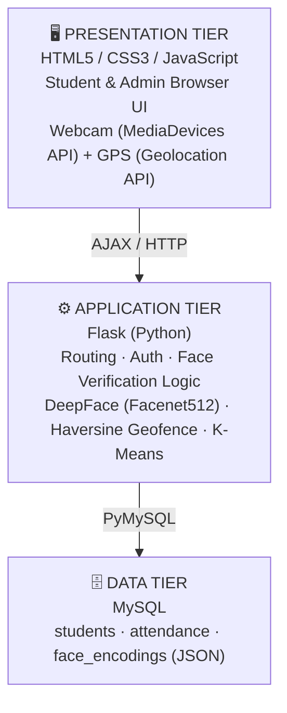

<div align="center">

# 🎯 Smart Attendance Management System (SAMS)

### AI-Powered Attendance Tracking with Facial Recognition, GPS Geofencing & ML Analytics

[](https://www.python.org/)
[](https://flask.palletsprojects.com/)
[](https://www.tensorflow.org/)
[](https://www.mysql.com/)
[](https://opencv.org/)
[](LICENSE)

*A tamper-proof, real-time attendance solution combining DeepFace facial recognition (Facenet512), Haversine-based GPS geofencing, and K-Means clustering analytics — deployable on any institution with just a browser and a webcam.*

</div>

---

## 📖 Table of Contents

- [Overview](#-overview)
- [Key Features](#-key-features)
- [System Architecture](#-system-architecture)
- [How It Works](#-how-it-works)
- [Tech Stack](#-tech-stack)
- [System Requirements](#-system-requirements)
- [Installation](#-installation)
- [Database Schema](#-database-schema)
- [API / Route Overview](#-api--route-overview)
- [Technical Highlights](#-technical-highlights)
- [Screenshots](#-screenshots)
- [Roadmap](#-roadmap)
- [References](#-references)
- [License](#-license)

---

## 🔍 Overview

Traditional attendance systems — paper registers, roll calls, RFID cards, barcode scanning — are prone to **proxy attendance**, **transcription errors**, and heavy administrative overhead. SAMS solves this by combining three independent verification layers into a single Flask web application:

1. **Biometric identity verification** — DeepFace (Facenet512) generates 512-dimensional facial embeddings, matched via cosine similarity.
2. **Physical location validation** — Haversine formula checks GPS coordinates against a configurable geofence radius.
3. **ML-driven analytics** — K-Means clustering classifies attendance patterns for administrator insights.

The result is a **cross-platform, browser-only** system with no native app installation, ready for institutional deployment via LAN or ngrok tunnel.

---

## ✨ Key Features

| Category | Feature |
|---|---|
| 🔐 Identity | Facenet512-based facial embeddings (512-D vectors), multi-shot enrollment (≥5 valid embeddings) |
| 📍 Location | GPS geofencing via Haversine formula, configurable radius (default 200 m) |
| 🚫 Anti-Duplication | Database-level composite unique key `(student_id, date)` + application logic |
| 👥 Dual Roles | Student self-service portal + Administrator oversight panel |
| 📊 Analytics | K-Means clustering for attendance pattern classification |
| 📁 Reporting | Department-wise filtered reports, one-click Excel export (openpyxl) |
| 🔒 Security | bcrypt password hashing, HttpOnly + SameSite=Lax session cookies |
| 🌐 Deployment | Pure browser-based UI (HTML5/CSS3/JS), no native app required |

---

## 🏗 System Architecture

SAMS follows a classic **three-tier architecture**:


Role separation (student vs. admin) is enforced via **Flask decorator functions** that validate session variables before granting access to CRUD routes.

---

## ⚙️ How It Works

### 1️⃣ Student Registration
- Submits Name, Register Number, Department, Email, Password.
- Backend validates password length (≥6 chars) and rejects duplicate register numbers/emails.
- Password hashed with **bcrypt**; record inserted into `students` table.

### 2️⃣ Face Enrollment
- Webcam activated via `navigator.mediaDevices.getUserMedia()`.
- Multiple frames captured at intervals, base64-JPEG encoded, sent via AJAX to `/save_face`.
- DeepFace extracts Facenet512 embeddings per frame; **≥5 valid embeddings** required to complete enrollment.
- Embeddings stored as a JSON array in the `face_encodings` column.

### 3️⃣ Attendance Verification (3-Stage Pipeline)

| Stage | Check | Action on Failure |
|---|---|---|
| 1 | **Geofence** — Haversine distance vs. `GEOFENCE_RADIUS` | Reject with distance-in-meters error |
| 2 | **Duplicate** — existing record for `(student_id, today)` | Discard request |
| 3 | **Biometric** — cosine similarity vs. stored embeddings | Reject if below threshold (0.50) |

On success: attendance record (timestamp, status, GPS coordinates) is inserted and confirmed on the frontend.

---

## 🧰 Tech Stack

| Component | Version | Purpose |
|---|---|---|
| Python | 3.9+ | Runtime environment |
| Flask | 2.3.3 | Web framework & routing |
| DeepFace | 0.0.88 | Facial recognition engine |
| OpenCV | 4.8.1 | Image decoding & preprocessing |
| TensorFlow | 2.15.0 | Deep learning backend for DeepFace |
| PyMySQL | 1.1.0 | MySQL database connector |
| bcrypt | 4.0.1 | Password hashing |
| scikit-learn | 1.4.0 | K-Means clustering analytics |
| pandas | 2.1.4 | Data manipulation for analytics |
| openpyxl | 3.1.2 | Excel report generation |
| pyngrok | Latest | Ngrok tunnel for remote access |

---

## 💻 System Requirements

**Hardware**
- Server: Python 3.x capable machine, 4 GB RAM min (8 GB recommended for TensorFlow/DeepFace)
- Client: Webcam-equipped device with modern browser (HTML5 MediaDevices + Geolocation API support)
- Database: MySQL 5.7+ (≈2–5 KB storage per student for embeddings)
- Network: Internet for ngrok tunnel, or local LAN deployment

---

## 🚀 Installation

```bash
# 1. Clone the repository
git clone https://github.com/<your-username>/smart-attendance-system.git
cd smart-attendance-system

# 2. Create and activate a virtual environment
python -m venv venv
source venv/bin/activate      # Windows: venv\Scripts\activate

# 3. Install dependencies
pip install -r requirements.txt

# 4. Configure MySQL database
mysql -u root -p < schema.sql

# 5. Set environment variables (.env)
FLASK_SECRET_KEY=your_secret_key
DB_HOST=localhost
DB_USER=root
DB_PASSWORD=your_password
DB_NAME=sams_db
GEOFENCE_LAT=<college_latitude>
GEOFENCE_LNG=<college_longitude>
GEOFENCE_RADIUS=200

# 6. Run the application
python app.py

# 7. (Optional) Expose via ngrok for remote access
ngrok http 5000
```

---

## 🗄 Database Schema

| Table | Key Columns | Notes |
|---|---|---|
| `students` | `id`, `name`, `register_number (UNIQUE)`, `department`, `email`, `password_hash`, `face_encodings (LONGTEXT/JSON)` | Stores up to N embeddings per student |
| `attendance` | `id`, `student_id (FK)`, `date`, `time`, `status`, `latitude`, `longitude` | `UNIQUE(student_id, date)` prevents duplicate marking |
| `admins` | `id`, `username`, `password_hash` | Admin credentials |

---

## 🔌 API / Route Overview

| Route | Method | Description |
|---|---|---|
| `/register` | POST | Create student account |
| `/save_face` | POST | Upload webcam frames, extract & store embeddings |
| `/mark_attendance` | GET | Load attendance capture page |
| `/verify_attendance` | POST | Run geofence → duplicate → biometric pipeline |
| `/admin/dashboard` | GET | Admin analytics overview |
| `/admin/reports` | GET | Filtered attendance reports |
| `/admin/export` | GET | Excel export via openpyxl |

---

## 🔬 Technical Highlights

- **Facial Embedding Extraction** — `DeepFace.represent()` with `model_name="Facenet512"`, `enforce_detection=False`, `detector_backend="skip"` since face framing is handled client-side.
- **Matching** — Cosine similarity: `similarity(A,B) = (A·B) / (‖A‖·‖B‖)`, threshold = **0.50** for confirmed match.
- **Geofencing** — Haversine great-circle distance formula on Earth radius R = 6,371,000 m, using student and campus lat/long.
- **Security** — `HttpOnly` cookies block JS access (XSS defense); `SameSite=Lax` blocks cross-origin cookie transmission (CSRF defense).

---

## 🖼 Screenshots

> _Add screenshots or a demo GIF of the student registration flow, face enrollment, and admin analytics dashboard here._

---

## 🗺 Roadmap

- [ ] Liveness detection (anti-spoofing for photo/video attacks)
- [ ] Mobile-native companion app
- [ ] Multi-campus geofence support
- [ ] Real-time notification system (SMS/Email alerts)
- [ ] Integration with academic ERP systems

---

## 📚 References

Key literature underpinning this work includes CNN-based attendance systems [Kakarla et al., 2020], face recognition automation [Nithya et al., 2020], RetinaFace/FaceNet approaches [Aryal et al., 2021], and geofencing-integrated ML attendance frameworks [Lakshmi, 2023]. Full reference list is available in the accompanying research paper.

---

## 📄 License

This project is licensed under the **MIT License** — see the [LICENSE](LICENSE) file for details.

---

<div align="center">

**Built with ❤️ for modern educational institutions**

⭐ Star this repo if you find it useful!

</div>


